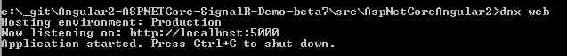
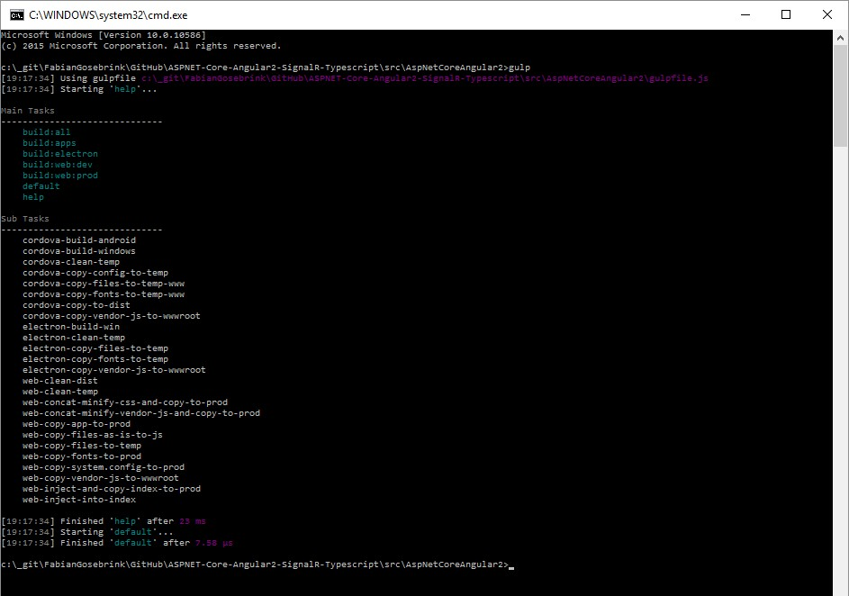
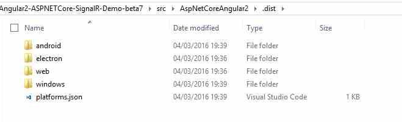
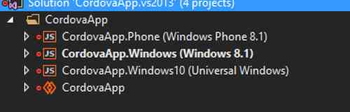
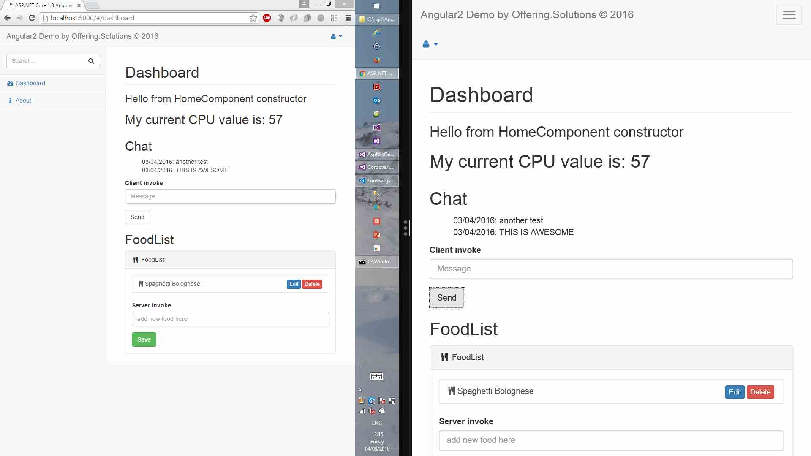

# Angular 2 // ASP.NET Core // SignalR 3 - XPlatform

## With this repository we can create a X-Platform / Cross Platform Application running with bower, npm, gulp, ASP.NET Core, SignalR 3, Cordova, Electron and Angular 2 with Typescript.

####Warning: I am working with Angular 2, which is currently beta, ASP.NET Core which is also an release candidate and SignalR 3 which is also not released yet...but it works. Enjoy :-)

Just clone this repo and run <pre>npm install</pre>
After this you can type <pre>dnx web</pre> to start the ASP.NET Server

This is the output after starting the dnx web server

After this you can browse to the site

Please the the gulp tasks running <pre>gulp</pre> on command line in the root folder

Running the Main Tasks will build you your application.

<pre>gulp build:all</pre>

Will give you the output in the .dist-Folder

<i>Electron</i>: Is containing the executable for the application 
<i>Android</i>: Is containing the Android app 
<i>Web</i>: Is containing the web-files to drop it on a server 
<i>Windows</i>: Is containing the Visual Studio Solution with Windows Phone 8.1, Windows 8.1 and the Windows 10 (Universal Windows) app 

Screenshots from the mobile emulator for Windows Phone:

Screenshots from the mobile emulator for Windows 8.1 App:

Screenshots from the executable:
