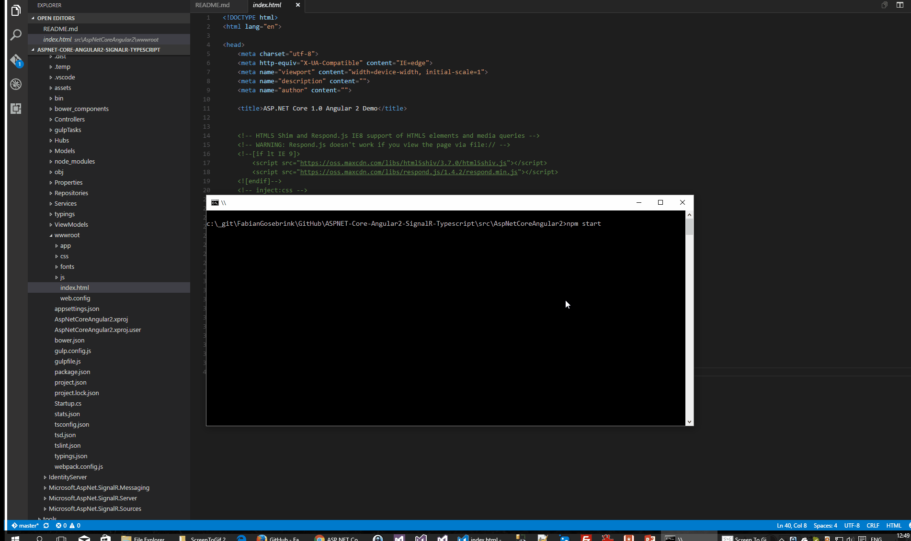
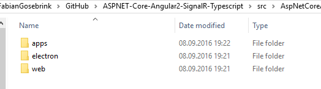

# Angular // ASP.NET Core // SignalR

## With this repository we can create a X-Platform / Cross Platform Application running with npm, ASP.NET Core, SignalR and Angular with Typescript.

## Social

### <a href="https://twitter.com/FabianGosebrink" target="_blank" class="twitter-follow-button" data-size="large" data-show-count="false">Follow @FabianGosebrink</a><script async src="//platform.twitter.com/widgets.js" charset="utf-8"></script>

### [blog.offering.solutions](http://blog.offering.solutions "blogLink")
### [fabian-gosebrink.com](http://fabian-gosebrink.com "homepage")


## Code

Just clone this repo and run 

```javascript 
npm start
```

Browse to
```javascript 
http://localhost:8080
```  
(No SignalR but live-reloading)

Or
```javascript 
http://localhost:5000
```
(SignalR but no live-reload)

To see the page then. SignalR is not working there because of CORS-Issues with signalR. Just load the application in Visual Studio and press the Play Button.



If you want to get production builds you can type

```javascript
gulp build:web:prod 
```

to build the production-ready build or type 

```javascript
gulp build:all
```

to get the .dist-folder filled with all the cross-platform builds.

After this you can type 

```csharp
dotnet run
```

to start the ASP.NET Server or just press the Play-Button in Visual Studio.

This is the output after starting the dnx web server


After this you can browse to the site


With 

```javascript
gulp
```
you can list all tasks




Mobile


Win 8.1


Desktop

