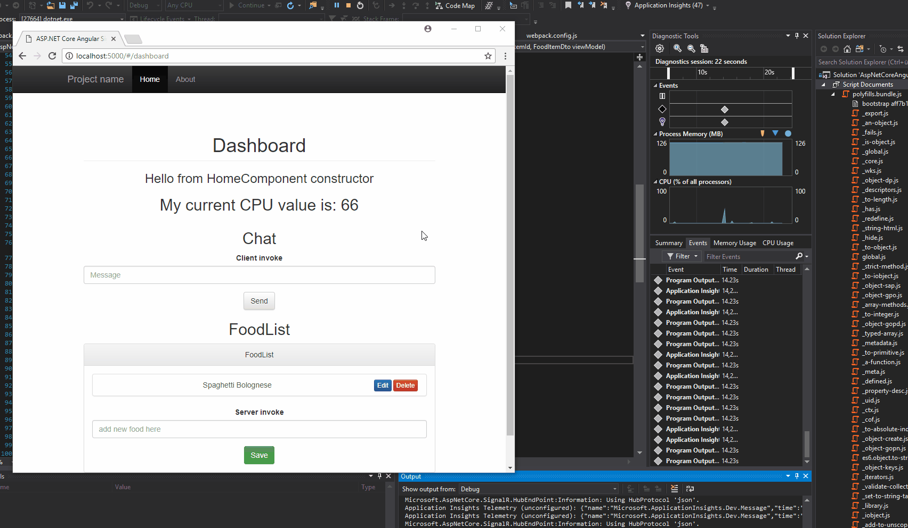
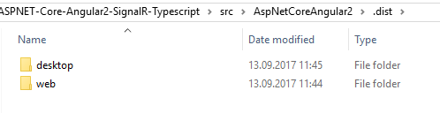

# Angular // ASP.NET Core // SignalR

## With this repository we are running an npm, ASP.NET Core, SignalR and Angular with Typescript Project



## Code

Just clone this repo and run 

```javascript 
npm start
```

Browse to
```javascript 
http://localhost:8080
```

to see the page then. 

Or just load the application in Visual Studio and press the Play Button.

For a build in the `.dist`-folder you just have to type:

```javascript 
npm run build-web
```

If you want to have the electron solution too you can type 

```javascript 
npm run build-desktop
```

For web and desktop you can type
```javascript 
npm run build-all
```
and you will find everything in the `.dist`-folder



